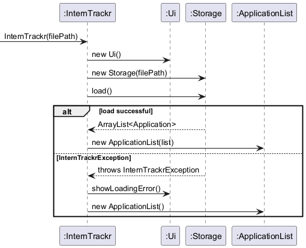
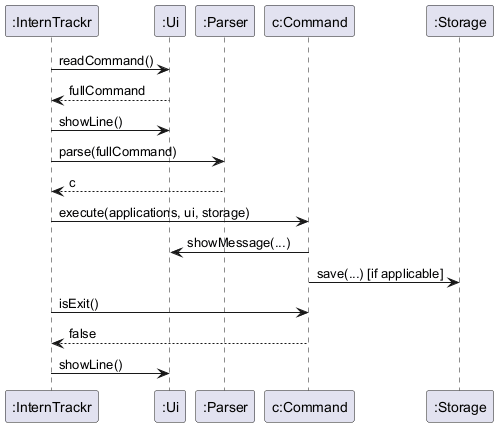
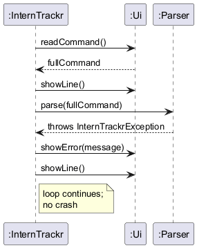
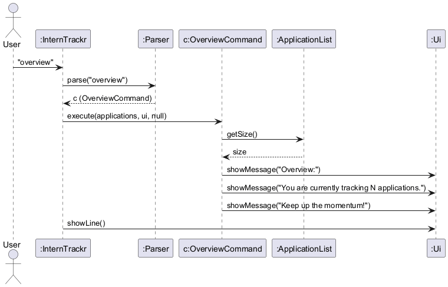

# Developer Guide

## Acknowledgements

{list here sources of all reused/adapted ideas, code, documentation, and third-party libraries -- include links to the original source as well}

## Design & implementation

{Describe the design and implementation of the product. Use UML diagrams and short code snippets where applicable.}

---
<!-- @@author N-SANJAI -->

### Application Architecture and Overview Feature

**Author:** Navaneethan Sanjai

#### 1. Main Control Flow & Architecture

`InternTrackr` is the entry point of the application. It ties together the core components and keeps the main loop running until the user decides to exit.

**1.1 Application Startup**

When the app launches, the `InternTrackr` constructor sets up three things: `Ui`, `Storage`, and `ApplicationList`.

* It tries to load any previously saved data from disk via `Storage`.
* If the file doesn't exist yet (e.g. first launch) or the data is corrupted, an `InternTrackrException` is caught internally. The app then starts fresh with an empty list and lets the user know via `Ui`.

**1.2 Main Command Loop**

After startup, `run()` kicks off the read-parse-execute loop, which keeps going until an `ExitCommand` flips the `isExit` flag to true.

* **Happy Path:** The user types a command, it gets parsed and executed, and the result is shown on screen.

* **Error Path:** If the command is unrecognised or the arguments are malformed, an `InternTrackrException` is thrown. The loop catches it and calls `Ui#showError()` — the app stays running rather than crashing.

#### 2. UI Component

The `Ui` class owns all terminal interaction — nothing else in the app touches `System.in` or `System.out` directly.

* **Responsibility:** Reading user input via `readCommand()`, and printing messages, dividers, and errors via `showMessage()` and `showError()`.
* **Design Rationale:** Keeping all I/O in one place means commands stay decoupled from the console entirely. This makes writing automated tests much simpler — you just redirect the streams once in test setup and you're done.

#### 3. Overview Feature Implementation

The `overview` command gives users a quick snapshot of how many internship applications they're currently tracking.

**Implementation Details:**

The feature is handled by `OverviewCommand`, which extends the abstract `Command` class. Here's what happens when it runs:

1. It queries `ApplicationList` directly for the current application count.
2. It passes that count to `Ui` to format and display the summary.
3. Since it's a read-only operation, it never touches `Storage`.

**End-to-End Execution:**

The diagram below shows the full flow — from the user typing `overview` all the way to the output appearing on screen.

#### 4. Design Considerations

**Aspect: Handling an empty application list during `overview`**

* **Alternative 1:** Throw an `InternTrackrException` to warn the user there's nothing to show.
* **Alternative 2 (Current Choice):** Display "0 applications" without any fuss.
* **Reasoning:** An empty list is a completely valid state — especially right after first launch. Treating it as an error would just confuse the user unnecessarily.

**Aspect: Passing dependencies to read-only commands**

* **Alternative 1:** Pass a valid `Storage` object to every command for consistency.
* **Alternative 2 (Current Choice):** Pass `null` for `Storage` when calling `OverviewCommand`.
* **Reasoning:** Since `OverviewCommand` never writes anything, giving it a live `Storage` reference risks accidental side effects. Passing `null` (guarded by `assert` statements) keeps the execution lightweight and the intent clear.

<!-- @@author -->

---

## Product scope
### Target user profile

{Describe the target user profile}

### Value proposition

{Describe the value proposition: what problem does it solve?}

## User Stories

|Version| As a ... | I want to ... | So that I can ...|
|--------|----------|---------------|------------------|
|v1.0|new user|see usage instructions|refer to them when I forget how to use the application|
|v2.0|user|find a to-do item by name|locate a to-do without having to go through the entire list|

## Non-Functional Requirements

{Give non-functional requirements}

## Glossary

* *glossary item* - Definition

## Instructions for manual testing

{Give instructions on how to do a manual product testing e.g., how to load sample data to be used for testing}
